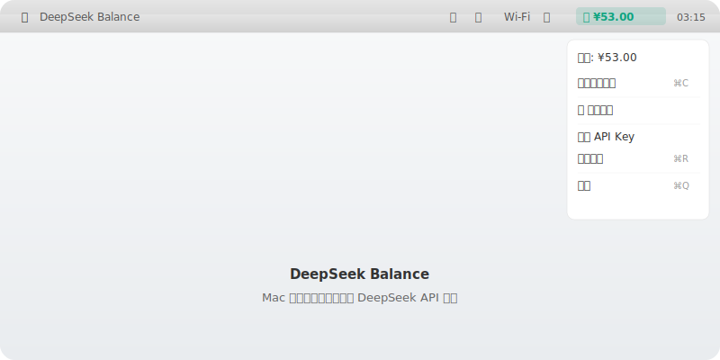

# DeepSeek Balance 💰

> 在 Mac 右上角菜单栏实时查看你的 DeepSeek API 余额，再也不用登录网页查了！



---

## 📖 这是什么？

DeepSeek Balance 是一个运行在 Mac 菜单栏的小工具。你打开它之后，右上角会显示你的 DeepSeek 账户还剩多少钱：

```
💰 ¥123.45
```

每 **5 分钟自动刷新**，余额变动一目了然。

---

## ✨ 功能一览

| 功能 | 说明 |
|------|------|
| 🔍 实时查询 | 打开就能看到余额，不用登录网页 |
| 🖥️ 菜单栏显示 | 藏在右上角，不占屏幕空间 |
| 🔑 修改 Key | 随时可以换 API Key |
| 🔄 自动刷新 | 每 5 分钟自动更新余额 |
| 📋 一键复制 | 点击「复制余额」直接粘贴使用 |
| 🚀 开机自启 | 设置后电脑开机自动运行 |
| 🌙 深色模式 | 完美适配 Mac 深色/浅色主题 |

---

## 📥 安装方法

### 方法一：一键安装（推荐）

打开 Mac 自带的「终端」应用（按 `Command + 空格`，搜索「终端」），粘贴下面三行命令：

```bash
git clone https://github.com/szboyawen/DeepSeekBalance.git
cd DeepSeekBalance
chmod +x install.sh && ./install.sh
```

安装完成后，右上角就会出现 `⏳` 图标。

### 方法二：手动安装

1. 下载这个项目 -> 点页面绿色的 **「Code」** → **「Download ZIP」**
2. 解压 ZIP 文件
3. 把 **`DeepSeekBalance.app`** 拖进「应用程序」文件夹
4. 双击打开（如果提示"无法验证开发者"，去 **系统设置 → 隐私与安全性 → 仍要打开**）

---

## 🚀 使用教程

### 第一步：获取 DeepSeek API Key

1. 打开浏览器，访问 **[platform.deepseek.com](https://platform.deepseek.com)**
2. 登录你的 DeepSeek 账号（没有的话注册一个）
3. 点左边的 **「API Keys」**
4. 点 **「Create API Key」**，输入名字（随便写），复制生成的 Key
5. Key 长这样：`sk-xxxxxxxxxxxxxxxxxxxxxxxxxxxxxxxxxxxxxxxx`

> ⚠️ **注意**：复制后请保存好，关掉页面就看不到了。

### 第二步：输入 Key

1. 打开 DeepSeek Balance（右上角菜单栏找到 `⏳` 或 `💰`）
2. 会弹出一个输入框，把刚才的 Key 粘贴进去
3. 点 **「保存」**

### 第三步：查看余额

右上角就会显示：

```
💰 ¥123.45
```

- 点击图标可以查看详细的菜单
- 点 **「点击复制余额」** 可直接复制数字
- 点 **「立即刷新」** 手动刷新
- 点 **「修改 API Key」** 更换 Key
- 点 **「开机自启」** 设置开机自动运行

---

## ❓ 常见问题

### 为什么显示 ❌？

可能是网络问题或者 Key 不正确。点 **「修改 API Key」** 重新输入试试。

### 为什么显示 🚫？

这个 API Key 没有余额信息，可能是免费额度用完了。

### 怎么开机自启？

点菜单栏图标 → 点 **「开机自启」**（✅ 表示已开启）。

### 怎么退出？

点菜单栏图标 → 点 **「退出」**。

### 怎么卸载？

把 `/Applications/DeepSeekBalance.app` 拖进废纸篓就行。

---

## 🛠 技术说明

- 语言：Swift
- 最低系统：macOS 11.0 (Big Sur)
- 芯片：Intel 和 Apple Silicon (M1/M2/M3/M4) 都支持
- 源码在 [Sources/main.swift](Sources/main.swift)

---

## 📄 License

MIT
